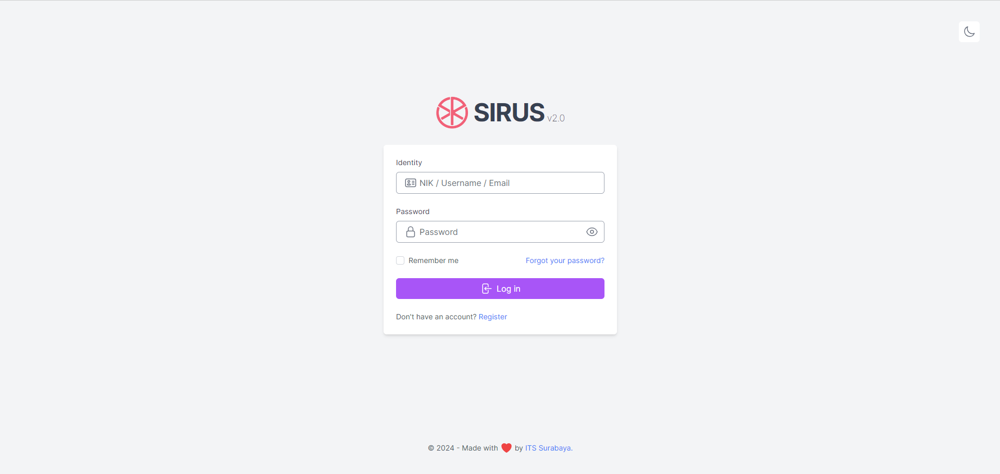
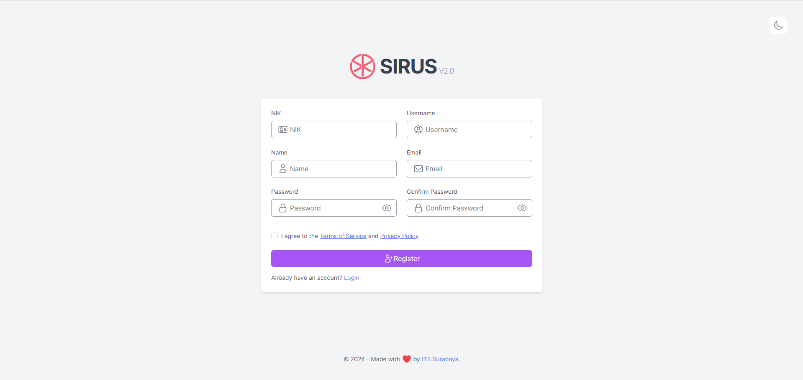
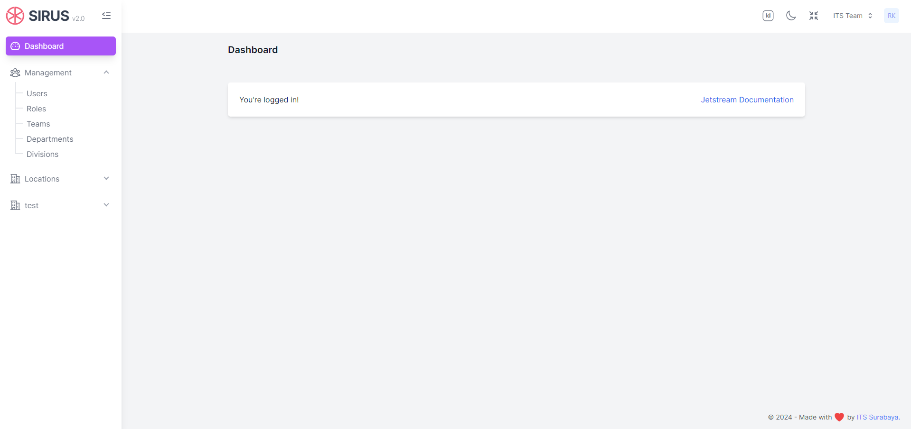

# laravel-jetstream-inertia-ui

Custom UI for [laravel jetstream](https://github.com/laravel/jetstream) (inertia stack).

> I recommend installing this package on a project that you are starting from scratch.

#### Usage
> NOTE: It doesn't matter if you use `vitejs` or `laravel-mix`, it will work in both cases.
1. Fresh install Laravel >= 11.0 and `cd` to your app.
2. Install laravel/jetstream

```sh
composer require laravel/jetstream

# after finish run this command

php artisan jetstream:install inertia --teams
```

3. Install reyptr27/laravel-jetstream-inertia-ui


```sh
composer require reyptr27/laravel-jetstream-inertia-ui --dev

# after finish run this command

# This package will detect if your project use vitejs or not by check if vite.config.js exist or not.
php artisan reyptr27-jetstream:replace inertia --teams
# This package is only available for Inertia Stack.

# then
npm install && npm run dev # or yarn && yarn dev
```

4. Configure your database.
5. Run `php artisan migrate`.
6. `php artisan serve`.

> Do not forget to change `APP_URL` in `.env` file and run `php artisan storage:link` if you want to enable `manageProfilePicture` feature.

#### Navigation

You will found sidebar links in:

`resources/js/Components/Sidebar/SidebarContent.vue`

#### Screens

|                                                |                                               |
| ---------------------------------------------- | --------------------------------------------- |
|        |    |
|    |                                               |
